# 叶片质量追溯系统 - 包图Mermaid代码

本文档提供系统完整功能包图的Mermaid代码，可直接在支持Mermaid的工具中渲染。

---

## 一、系统顶层包图（Top-Level Package Diagram）

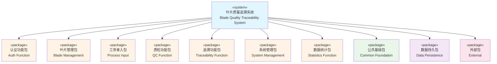

---

## 二、系统完整包图（Complete System Package Diagram）

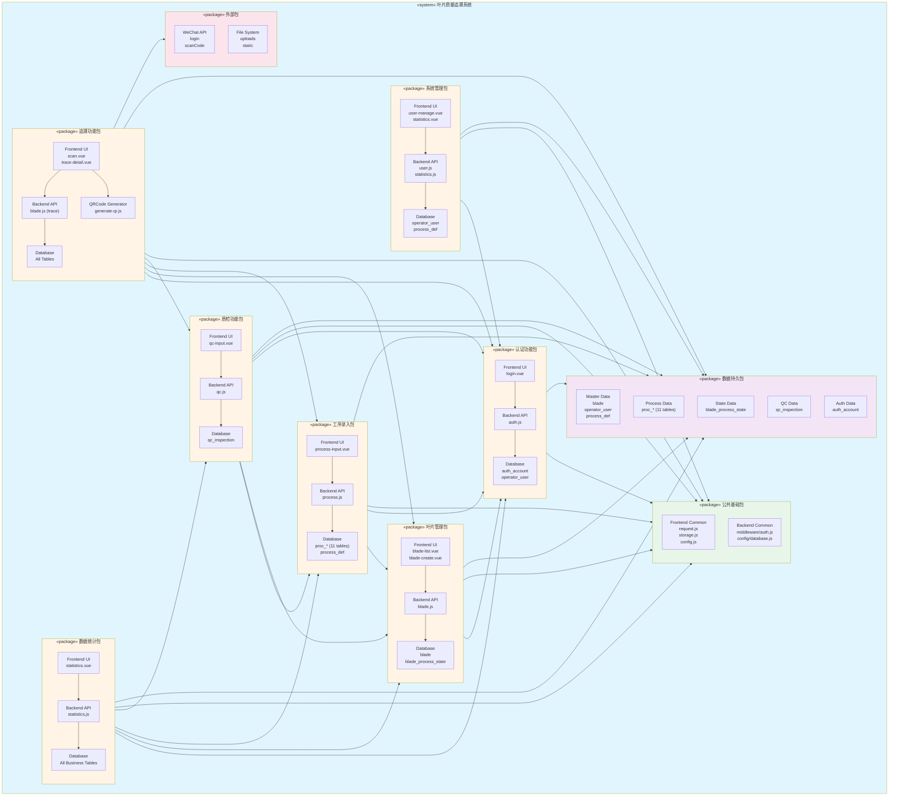

---

## 三、系统包依赖关系图（Package Dependencies）

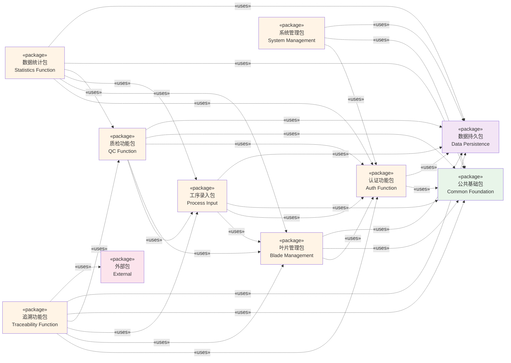

---

## 四、功能包内部结构图（Function Package Internal Structure）

### 4.1 认证功能包内部结构

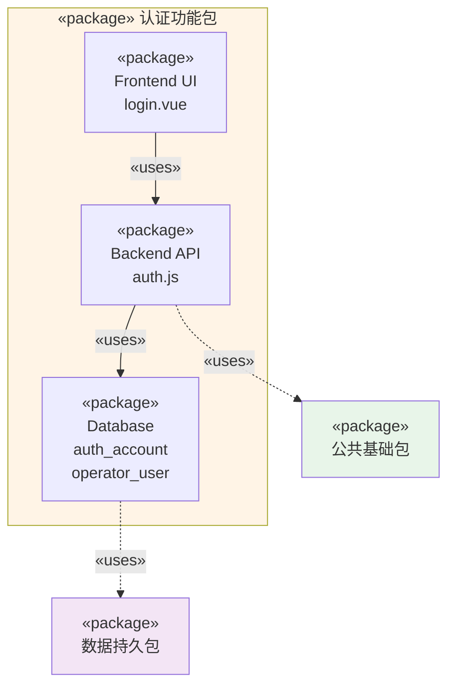

### 4.2 叶片管理包内部结构

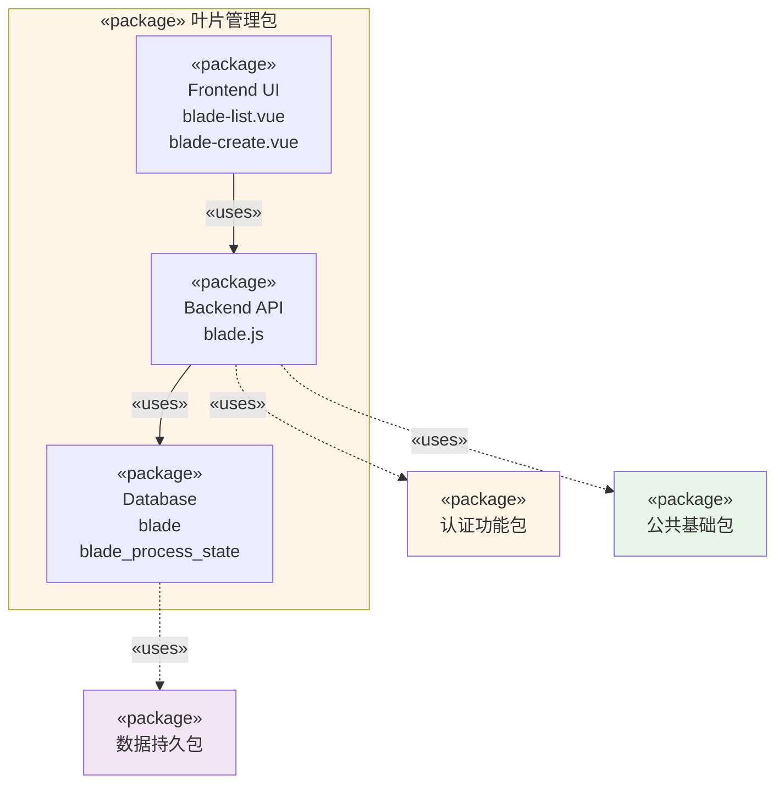

### 4.3 工序录入包内部结构

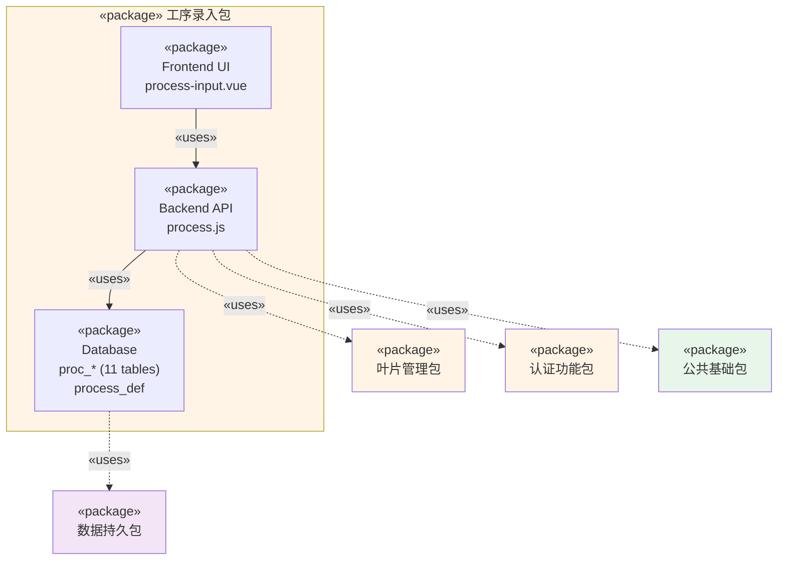

### 4.4 质检功能包内部结构

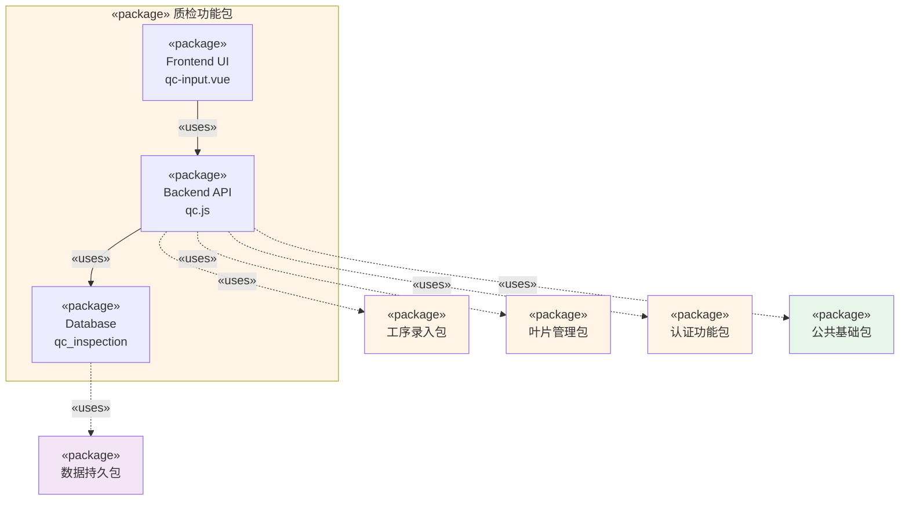

### 4.5 追溯功能包内部结构

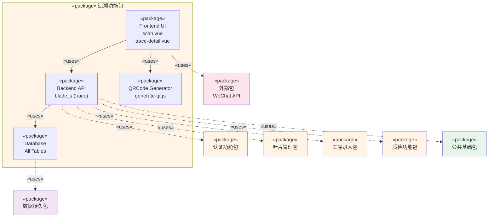

### 4.6 系统管理包内部结构

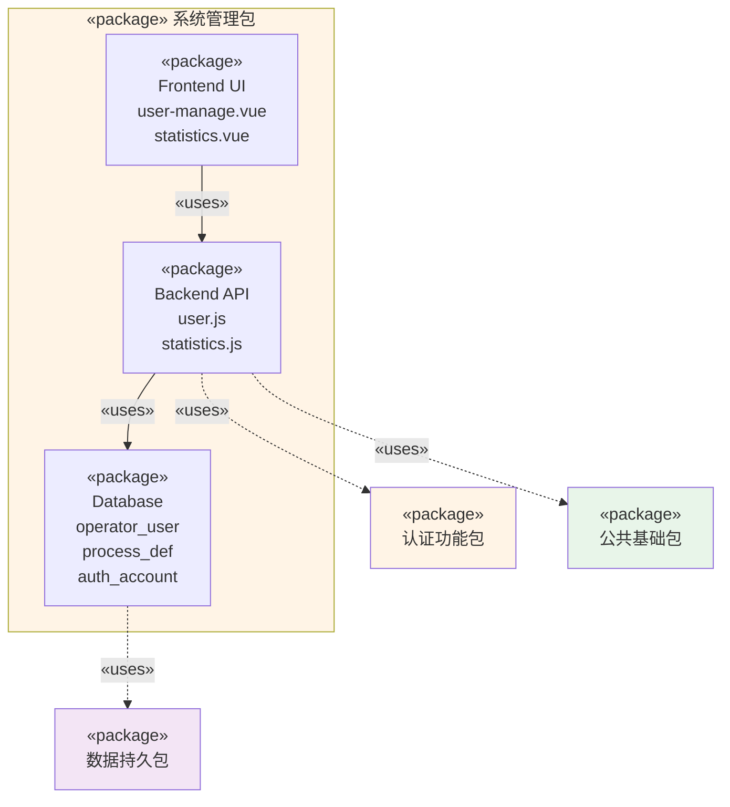

### 4.7 数据统计包内部结构

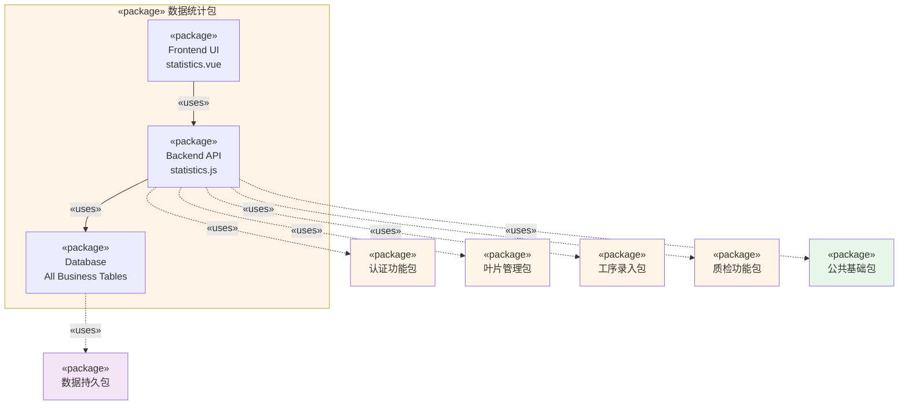

---

## 五、数据持久包详细结构

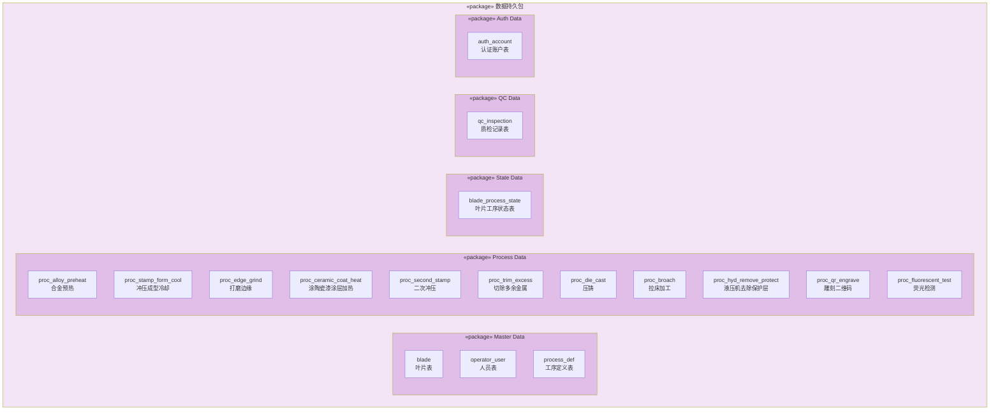

---

## 六、公共基础包详细结构

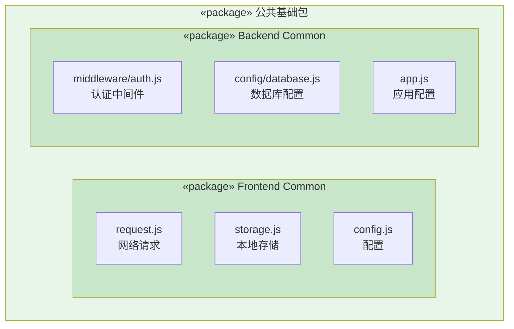

---

## 七、系统完整包图（综合视图）

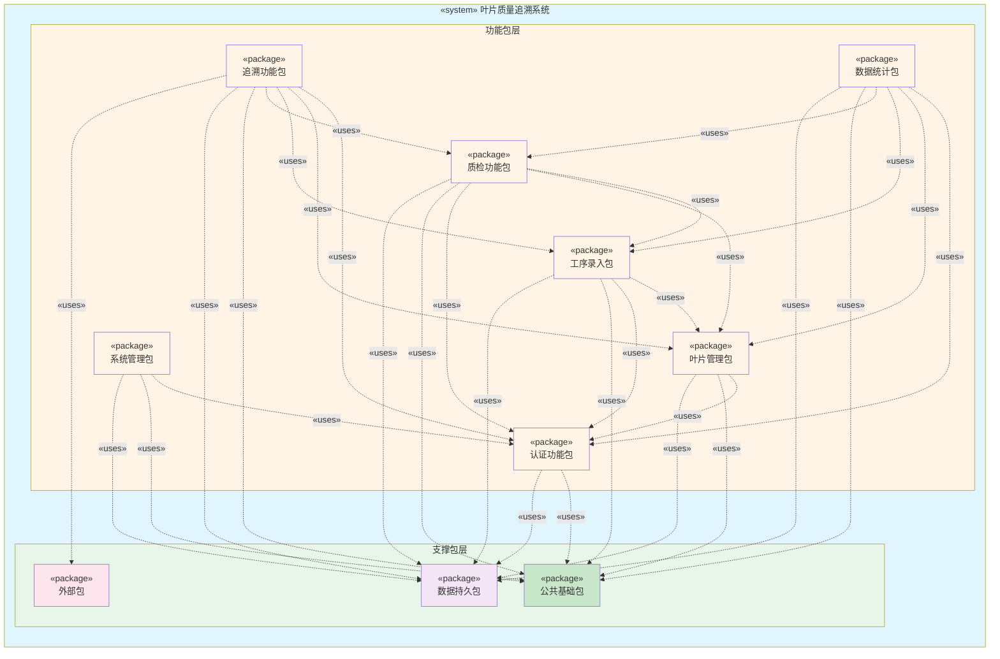

---

## 八、使用说明

### 8.1 Mermaid渲染工具

以下工具支持Mermaid代码渲染：

1. **在线工具**：
   - [Mermaid Live Editor](https://mermaid.live/)
   - [GitHub/GitLab](https://github.com/) - 在Markdown文件中直接渲染
   - [Notion](https://www.notion.so/) - 支持Mermaid代码块

2. **VS Code插件**：
   - Markdown Preview Mermaid Support
   - Mermaid Preview

3. **文档工具**：
   - [Typora](https://typora.io/) - 支持Mermaid
   - [Obsidian](https://obsidian.md/) - 支持Mermaid

### 8.2 使用方法

1. **在线使用**：
   - 访问 https://mermaid.live/
   - 复制上述Mermaid代码
   - 粘贴到编辑器中
   - 自动渲染为图表

2. **在Markdown中使用**：
   ```markdown
   ```mermaid
   graph TB
       A[节点A] --> B[节点B]
   ```
   ```

3. **导出图片**：
   - 在Mermaid Live Editor中点击"Actions" → "Download PNG/SVG"
   - 或使用Mermaid CLI工具导出

### 8.3 代码说明

- **节点样式**：使用`style`定义节点颜色
- **依赖关系**：使用`-.->`表示依赖关系（虚线箭头）
- **包含关系**：使用`-->`表示包含关系（实线箭头）
- **子图**：使用`subgraph`创建包内部结构
- **构造型**：使用`«package»`、`«system»`表示UML构造型

---

**文档版本：** 1.0  
**最后更新：** 2024-12-27  
**维护者：** 系统架构团队

